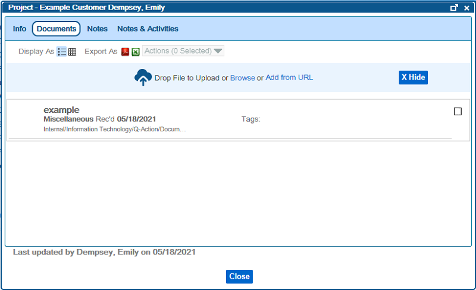

# Documents Tab on Custom Objects
---
The Documents Tab on a Custom Object View Screen displays all the Documents that are associated with the Custom Object.

_Documents Tab_

Additionally, you can add documents to this screen, and the system will do its best to automatically index the document for you.  Depending on how the system is configured (e.g., whether the Custom Object has a Default Classification or not), you may still need to input some index fields, but if the system can automatically fill out an index field with the Custom Object you are viewing, it will.   This screen functions similarly to a normal search for document associated with the Custom Object on a Document Search screen.  Perform Actions on one or more documents by selecting the checkbox for a desired document, and then selecting the desired action from the Actions menu at the top of the screen.