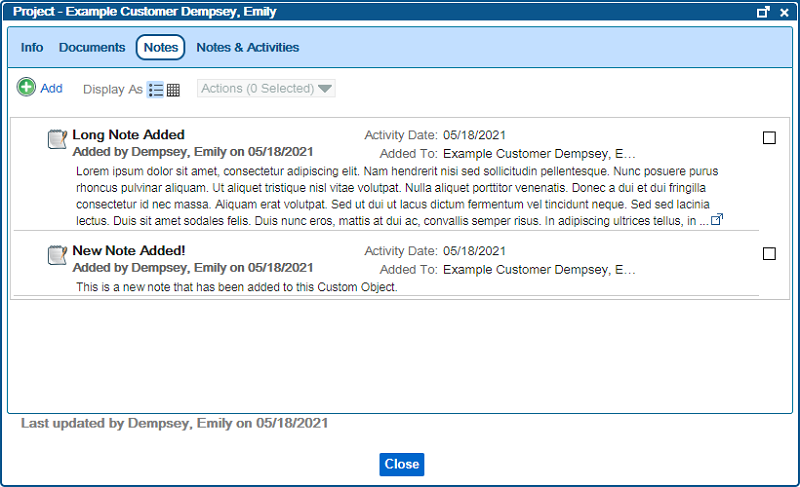
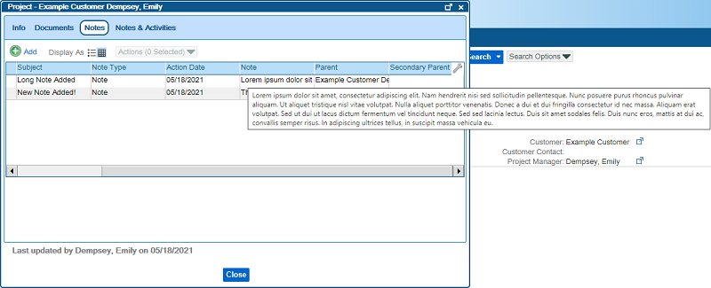

# Notes Tab on Custom Objects
---

The Notes Tab on a Custom Object View Screen displays Notes that have been added to the Custom Object, and allows you to add your own Notes.

### Notes Tab - List View  
  

As you can see in the screenshot above, a long Note will cut off, and you can view the full text of the Note by clicking the pop-out icon () that appears at the end of the Note on this screen.  Alternatively, you can switch to Grid View and hover over the Note column to see the full text.  
 

### Notes Tab - Grid View  
