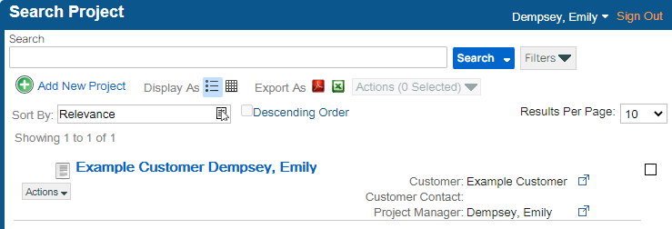
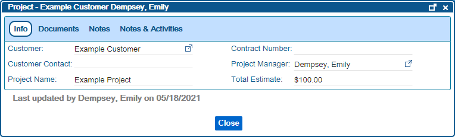
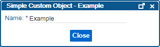

# Viewing Custom Objects
---

You can view a Custom Object from a Custom Object Search by clicking on the blue title of the Custom Object.  Alternatively, to view a Custom Object that is a field on a different search result, you can click the pop-out icon () to view the Custom Object.

In the example Project Search below, you could view the Project by clicking on the blue title, or you could view the Customer or Project Manager associated with the Project by clicking on the respective pop-out icon ().

**Example Project Search**  
  

Below is what the Custom Object View screen would look like for this example Project.  
 

Custom Object View Screen  
  

The Info tab is open by default.  This tab contains the index fields for the Custom Object.  Like in the Search results, you can view associated Custom Objects by clicking on the pop-out icon ().  To edit an index field on the Custom Object, simply click into the field, modify the value, and then the value will be saved when you click out of the field.  Some Custom Objects are configured to only show the Info tab, and for those custom objects, you may not see any tabs at the top.  
 

Example Simple Custom Object  
  

  When tabs do show up, the tabs that you see will vary based on how the Custom Object has been configured.  Click the links below to learn more about the standard tabs you might see.  
 

*   [Documents](Documents_Tab_on_Custom_Objects.htm)
*   [Notes](Notes_Tab_on_Custom_Objects.htm)