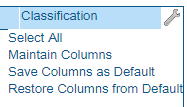
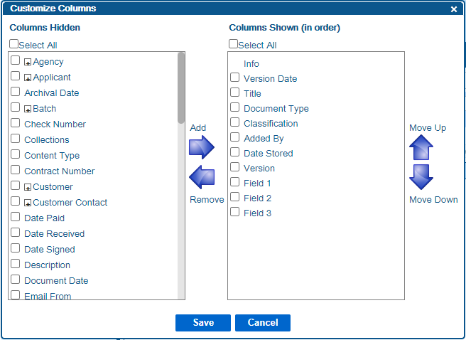

# Customizing Search Columns
---
You can customize the columns you see on the grid display on the search screen, or in a [search export](Exporting_Search_Results.htm), by following the steps below.

1.  Locate the Display As options below the search filters.  
    
2.  When you select the grid icon (), a grid will appear in the search results area.  
    (You can switch back to viewing a list by clicking on the list icon ().
3.  Click on the wrench in the top right corner of the grid.  This will open a drop-down menu.  
    
4.  Click Maintain Columns. This will open the Customize Columns Screen.  
    
5.  Add columns to the right side of the screen to include them in the search results.  
    Remove columns back to the left side of the screen and they will not show up in the search results.  
    Move columns up or down to change the order that they will appear in the search results.
6.  Click Save once you have the columns you want in the order you want them in on the right side of the screen.

The columns you just saved will appear in the search grid as long as you are on this search screen.  If you export the search, the columns you selected will appear in the exported results.

If you do nothing else, then once you leave the search screen, the next time you return, the columns in the grid view will revert to the default columns.

You can update the default columns before leaving the search screen by clicking the wrench icon again and selecting Save Columns as Default.

If you ever want to revert the default columns for a given grid to the system default, then click the wrench icon and select Restore Columns from Default.  Note that this will overwrite whatever columns you may have saved as default previously.