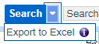
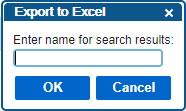
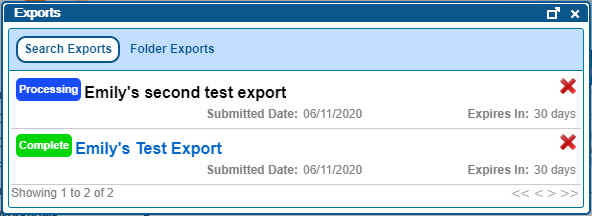

# Exporting Search Results
---
Usually, when performing searches, the user is trying to locate something to look at or perform work on within QAction.  However, sometimes a user may instead wish to perform a search in order to generate a report about data in QAction to analyze, present, or work with elsewhere.
There are two ways to export data from a search:
* Have the system run the search in the background and send the user a notification once the results have been exported.
* Run the search in the browser and then manually export the results.  
No matter which way you plan to export data from your search, first follow these steps:
1. Add the desired filters for the search.
2. [Customize the columns](../performing-searches/customizing-search-columns.md) you want to include in your search results.  
    (If running a search in the browser, you can also do this step later.)
Then, follow the steps below for the type of export you want to do.

## Run Search in Background
This option allows the user to continue using QAction while the search executes and exports, rather than having to wait on the search screen for the search to complete in the browser.
Once the filters and columns for the search are all set up, click the arrow on the right of the Search button. This will open the Search drop-down menu.

### Search drop-down menu  

Click on the Export to Excel option.  This will open the Export to Excel window.

### Export to Excel window  

Enter a name for the export, and then click OK.  A message will display indicating that the export has been submitted.

### Export successfully submitted message  

To view the status of the export, click on your username in the top right corner of the application to open a drop-down menu and then click Exports in the drop-down menu.  This will open the Exports window.

### Search Exports in the Exports Window  

Open a completed export by clicking on the title of the export.  This will download an Excel spreadsheet containing the results of the completed search.

## Run Search in Browser
This option allows the user to open and work with search results in QAction in addition to exporting the results once the search is completed.
Once the filters and columns for the search are all set up, click the Search button.  This will perform the search and display the results in the browser.
Once the results are displayed, locate the Export As options above the search results.

### Export As Options  

If you want to export the results as a PDF, click on the Adobe icon. If you want to export the results as an Excel document, click on the Excel icon. If there are a manageable number of results, the system will immediately generate a PDF or Excel document. You may briefly see the following message while the document is generated, though often the process is quick enough you may miss it.

### Grid Export Rendering Message  

Once the document is generated, it immediately begins downloading through your browser.   If there are a very large number of results, the system will instead ask the user to name the export and then generate the document in the background much like it does when the user runs the entire search in the background.  After entering a name for the export job, you will see the message below.

### Grid Export Success Message  

This export can also be viewed in the user's Exports window as described in the previous section.