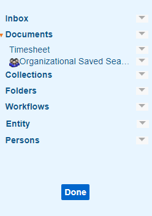

# Organizing Personal and Organizational Saved Searches
---
Saved searches can be created using any of the tabs in your left navigation pane.  You may wish to reorder, group, or delete Saved Searches.  

To do so, click **Organize** at the bottom of the left-hand menu.  

Grey arrows appear next to each item.  Also, the Organization icon () appears next to Organizational Saved Searches (searches that were created by a Saved Search Manager).

Every item in the left-hand menu is one of the following: a **Tab** (e.g. **Documents**), a **Personal** Saved Search, or an **Organizational** Saved Search.

## Example Left-Hand Menu - Organize Button Clicked  

Every item will have an option in its drop-down menu to **Set as start page**.  If you select this, that means that the next time you log in, the very first page you see will be the Tab or Saved Search that you selected.

Tabs will have an option to **Create Group**.  This allows you to name a new heading under that Tab (or under another group under that Tab!) which you can use to organize your saved searches.  Simply click down on and then drag a Saved Search to re-order it or put it into a group.  Groups can be collapsed and expanded just like Tabs.

Tabs and Organizational Saved Searches have the option to **Hide** that item, except for a few Tabs that cannot be hidden.  A hidden item will be greyed out in this Organize mode, and will not show up after you click **Done**.  You can unhide an item from its drop-down menu.

Personal Searches will have options to **Edit Name** and **Delete**.  

**Edit Name** allows you to rename the Saved Search right there in the left-hand menu without needing to open the Save Search window.  

**Delete** will completely delete the search from the system.  You will be given a confirmation pop-up, and if you confirm, there is no way to reverse that action short of re-creating the saved search.