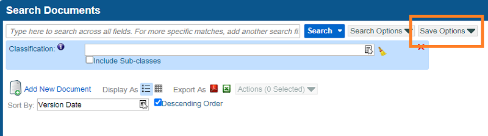

# Recent Changes to Saved Searches & Subscriptions
---
## Saved Searches & Checklists
The biggest change that users will notice right off the bat is the new Save Options menu on search screens.

### New Save Options Drop-Down  

This new Save Options menu contains all of the relevant options for users to create, subscribe to, and modify saved searches and checklists in the system. The old Search menu that used to contain these options now only contains the option to [Export to Excel](/docs/performing-searches/exporting-search-results).

When a user opens a saved search from the left-hand menu, the name of the saved search now appears at the top of the screen.

### New Saved Search Name Display  

When the user changes any of the search fields on an open saved search and clicks Search, then an asterisk(\*) will appear to indicate that unsaved changes have been made to the search.

### New Asterisk Indicating Unsaved Changes  

The options to Save, Modify, or Create New have all been split out into separate menu items, so that the user can select the action they want to take rather than navigating a more complicated screen that does everything.

### New Save Options Menu Items  

The Save option simply saves the changes that have been made to the search. A confirmation will appear once the search has been saved.

### New Saved Search Confirmation  

The Create New Saved Search and Create New Checklist options allow the user to create a whole new saved search based on the saved search they have open.  This is similar to "Save As" functionality in Microsoft Word.

The Modify option opens a screen for the user to edit the search's name, Auto Search setting, and Subscription to the saved search.

### New Modify Saved Search Screen  

Learn more about Saved Searches [here](/docs/performing-searches/saved-search/).

## Subscriptions
Subscriptions still work the same as they used to in the left-hand menu, but on the search screen itself, there is no longer a separate menu item to subscribe to a saved search. Instead, you must select the Modify option on the Save Options drop-down.

### New Save Options Menu Items  

This opens a screen where you can toggle on or off your subscription to the saved search and then click Save.

### New Modify Saved Search Screen  

This ensures that you don't subscribe to a saved search with unsaved changes, since your subscription will be saved alongside any updates to the saved search.

Learn more about subscriptions [here](/docs/performing-searches/saved-search/subscribing-to-a-saved-search).