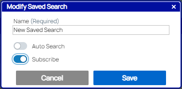
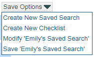
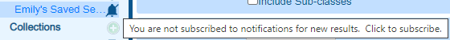
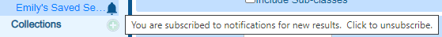

# Subscribing to a Saved Search
---
Subscriptions allow you to automatically receive e-mail notifications when there are new results in a Saved Search.  You can also subscribe to events on specific documents, which is covered in [a different topic](Subscribe_to_a_Document.htm).

When you first create a [Saved Search](Saved_Searches_Overview.htm), you can turn on the Subscribe toggle to subscribe to the search immediately.

## Subscribe Toggle in Create Saved Search Window  
  

When you already have a Saved Search open on the search screen, you can toggle your subscription to it on or off by selecting the Modify option in the Save Options drop-down.

## Save Options Menu Items  

To subscribe to an existing Saved Search without needing to open it, hover over the search's name in the left-hand menu.  A not subscribed icon() will appear.  If you hover another moment, a tool tip will join it.

## Not Subscribed Tool Tip  
  

After you click the not subscribed icon(), then a Subscribed icon() will appear to indicate that you are subscribed to the search.  If you hover over it, a new tool tip will appear.

## Subscribed Tool Tip  

If you make any changes to a Saved Search that you want to subscribe to, either use the Modify screen to subscribe, or be sure to also Save your saved search if you subscribe through the left-hand menu. Otherwise, your changes won't apply to your subscription.