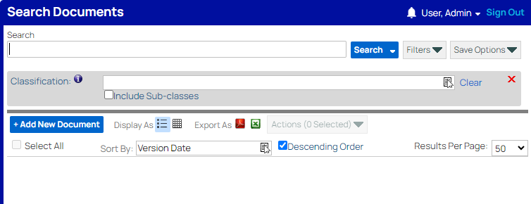
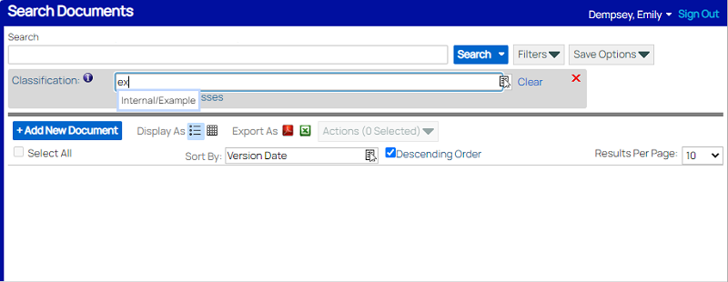
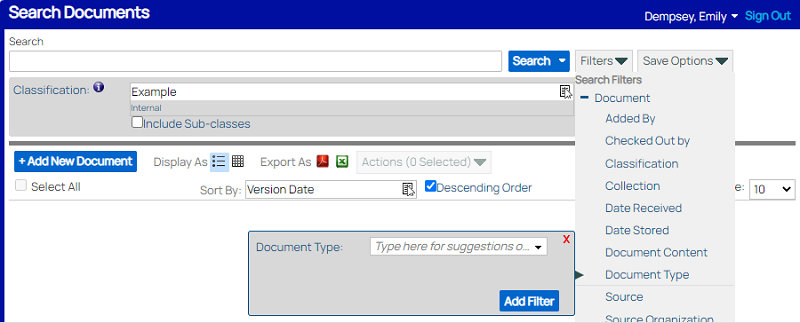
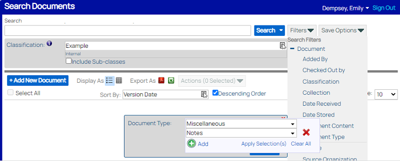
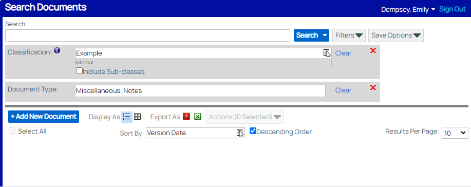

# Tutorial: Performing a Search
---

Follow the steps below to walk through a simple Document search.

1.  Click on Documents in the left-hand menu to open the Search Documents screen.  
      
    The screen will already have the Classification filter by default.
2.  Start typing a Classification into the Classification filter and select the appropriate suggestion.  
      
    Or, click the Select button () on the filter to open the Select Classification screen and locate a Classification.  
    If you select the wrong thing, you can clear the filter by clicking the Clear button ().  
    You can select any Classification you want for this tutorial. (You may not have the pictured Classification.)
3.  Click the Search Options drop-down, expand the Documents section by clicking the plus sign next to it, and then click Document Type.  
    
4.  Select a value for the filter.    
    You can search for multiple Document Types in the same search by clicking the Add button that appears on the filter.  
      
    You can select any Document Type(s) you want for this tutorial. (Again, you may not have the pictured Document Types.)
5.  Click Apply Selection(s) once you have entered all of the document types you want to search for, then click Add Filter to add the filter with the selected value(s) to the search.  
    
6.  (Optional) Add any other filters you want to by repeating step 4.  Learn more about adding search filters in [Understanding Search Filters](Types_of_Search_Filters.htm).
7.  When you are done adding filters, click Search.  
    The results of the search will populate at the bottom of the screen.  Read more in [Understanding Search Results](Understanding_Search_Results.htm).

You might get an error message that the search returned too many results.  If this happens, consider adding more filters to narrow down the search, such as Date Received.

Other Search Actions
--------------------

Instead of or in addition to running a search, you can:

[Save the search](Saved_Searches_Overview.htm) for future use, so that you don't have to re-build it if this is a search you may run multiple times.  Do this by clicking the Save Options drop-down.

[Export the search results](Exporting_Search_Results.htm) to Excel.  You can do this in the background without waiting for search results to load in the browser by clicking on the down arrow on the side of the Search button.  Otherwise, after you have already run the search, you can click on the relevant Export As icon.