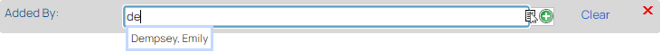
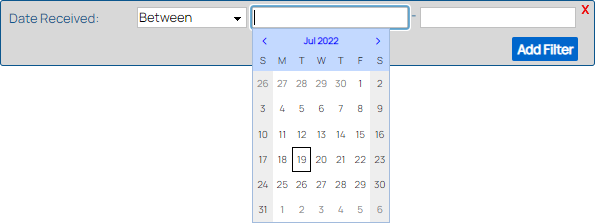
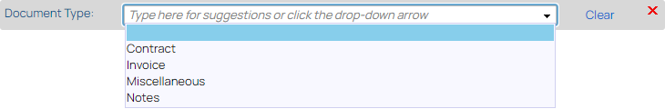

# Types of Search Filters
{: .no_toc }
---
Review all of the different types of filters available on Search screens below.

1. TOC
{:toc}

## Free-Text Filters
Some filters are just plain text and not associated with any particular objects in the system, such as document titles and document content.

When searching with these filters, you must manually type in the value you want to search for.  You can also form more specific queries with these filters using special syntax.  Learn more in [Using Free-Text Filters](Using_Free-Text_Filters.htm).

Some of these filters have an Exact Value Match checkbox and/or a No Value checkbox.

When Exact Value Match is selected, only results with the exact term(s) entered appear in the search results.  If this is not checked, then partial matches may be included.

When No Value checkbox is selected, the filter searches for items that have no value for the selected index field, such as documents for which the title was left blank.

All filters have a Clear icon () which you can click to clear out the value(s) in the filter.

## User & Custom Object Filters
With these filters, you can find items related to a specific user or [Custom Object](Custom_Objects_Overview.htm).  

User Filter Suggestion  

When searching with one of these filters, start typing into the search filter and then select a suggestion, or click the Select button () to open a separate Select search window where you can search for the specific user or custom object you want to use in your main search.

Select Search Window  

Click on a checkbox at the left of the screen to choose the user or custom object you want to use in your search filter, and then click Select to apply it and return to your main search.

Read more about using Custom Object filters in [Understanding Search Filters](Understanding_Search_Filters.htm).

## Hierarchy Filters
Hierarchy filters allow you to search for items related to anything in a certain hierarchy node, such as a document Classification or a user group.

When searching with one of these filters, start typing into the search filter and then select a suggestion, or click the Select button () to open a separate Select \[Hierarchy\] window where you can navigate to the hierarchy node you wish to use in your search.

### Select Classification Window Example  
  

Navigate the hierarchy by clicking plus signs to open folders and minus signs to close them.  Click on the hierarchy node you want to use in your search filter when you find it, and then click Select to apply it and return to your main search.

## Date Filters
Date filters allow you to search for items associated with a specific date or range of dates.

When searching with one of these filters, first select the type of date range you want to use (the default is Between, but there are many options available).  

The type of range you use will determine whether you are prompted for specific dates or not.  For instance, if you select Today as the date range, you do not need to enter any specific dates.  If however you select On or Before, you will then need to enter a specific date, and if you leave the range as Between, then you will need to enter two specific dates.

### Example - Date Received Filter  

## Currency Filters
Currency filters allow you to search for items with a range of values on the given field.

Much like Date filters, you must first select the type of range you want to use, and that will determine what other values you must enter.

### Example - Currency Filter on Search Screen - Invoice Amount  

## List of Value Filters
List of Value (LOV) filters are for index fields that have a pre-defined set of possible values, such as month or document type.

When searching with one of these filters, start typing into the search filter and then select a suggestion, or click the down arrow to open a list of the possible values to select.

### Example LOV Filter on Search Screen - Document Type  

## Multi-Value Filters
Many search filters allow you to add multiple values to search for.  This will function like an OR in the search.  This means that if you add values 1 and 2 to the search filter, then you are looking for items that have value 1 OR value 2 for that index field.

Filters that allow you to add multiple values will have an Add icon () after you select the first value.

### Example - Document Type Allows Multiple Values - Add Icon  

You can remove extra values from the filter by clicking the Remove icon () that appears.  Clicking Clear All clears out ALL of the values in the filter.

### Example - Document Type Allows Multiple Values - Adding Multiple Values  

When you are done adding values to the filter, click Apply Selection(s).  The values you selected for the filter will appear in a comma-separated list.

### Example - Document Type Allows Multiple Values - Multiple Values Applied  
