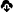
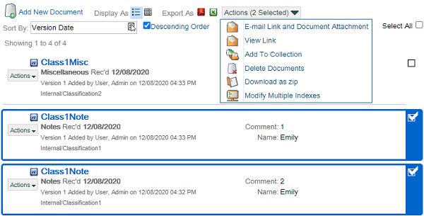

# Add Document from URL
---
This is an optional feature that may or may not be enabled in your environment.  If you would like to use this feature and it is not available, please contact your systems administrator.

This feature enables users to add documents to the system from a URL, such as a link to a Google Doc.  Documents added this way are not actually stored in the system, but can be queried, added to folders, etc just like other documents.  When users open such documents, a new tab launches with the URL for the document.

{: .important}
Q-Action has no control over whether documents added this way are deleted externally.  So if for example a link to a Google Doc is saved in Q-Action, and then the Google Doc is deleted from the user's Google account, then the link will still be in Q-Action and simply fail to load when a user tries to open it.

When this feature is enabled, anywhere there is an option to Browse to add files to the system, the option to Add from URL will also be available.

## Add From URL Option Example - Drop Files Area on Folders and etc  

## Add From URL Option Example - Fresh Upload Documents Screen  

## Add From URL Option Example - Upload Documents Screen While Uploading  

* When you click the Add from URL option, the Add from URL screen opens.

## Add From URL Screen  

* After you click Submit, the system will validate the entered URL and display a message if there is an error.  Note that valid URLs must begin with `https://`.
* If there is no error, you will then be able to index the document.  If you added the document on the Upload Documents screen, then you will simply return to that screen; otherwise, the Document Indexing screen will display.
* On the Upload Documents screen, documents added from a URL will have an open in new tab icon () instead of the download icon ().

## Document Added From URL on Upload Documents Screen  

Elsewhere in the system, such as on the Search Documents screen, documents added from a URL will have a link icon () as their Document Type icon.

## Document Added From URL on Search Screen  

* The document URL will open in a new tab when the user clicks on the blue title of the document (e.g. Updated Navigation in the screen shot above), or when the user selects the Open Link option in the Actions drop-down menu.

## Open Link Option in Actions Menu  
