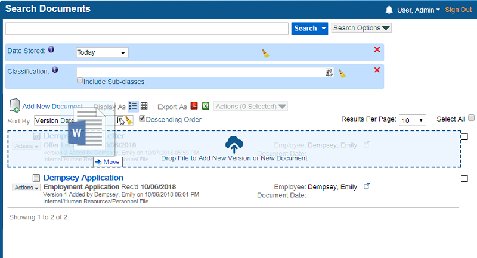

# Add Documents on a Search Screen
---
When you perform a search on the Search Documents screen, you can add a new document or a new version of an existing document directly on the search screen.  

1.  From the left navigation pane, click Documents.  
    The Search Documents screen appears.  
    
2.  Use the Search Options drop-down to add filters, and then click Search.  
    The search results appear.
3.  Drag & drop a file over a document in the search results.  
    
4.  If your installation of Q-Action has document versioning enabled, then the Document Preferences window appears.  
      
    Note that if a document is checked out by another user, the Document Preferences window only has the Add New Document option available.  
      
    Select Add New Document and click OK.
5.  The Document Indexing window appears.  
    
6.  Enter information in the missing fields and click Save.  
    A new document is added.  
    

To add a new version of an existing document instead, drop a file directly over an existing document, and when the Document Preferences window appears, click Check in as New Version > OK.