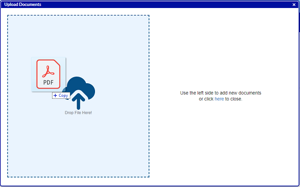
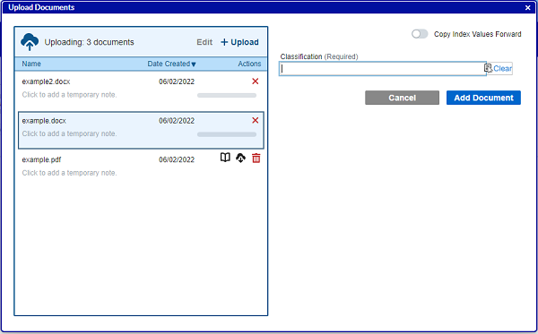
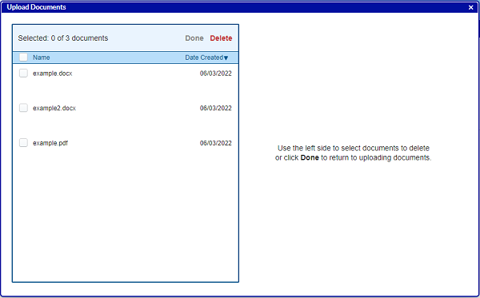

# Upload Documents
---
Add documents on the Document Search screen or with the Add Documents shortcut () on the left navigation pane next to the Documents tab.

An optional feature may or may not be enabled in your environment to add documents from URLs.  Since that functionality is optional, it is covered in a separate topic: [Add Document From URL](Add_Document_From_URL.htm)

Users can upload multiple documents simultaneously by browsing for files or by dragging new files to the Drop Files area. Users will be able to index documents while the content is uploading to the server.

To use the Upload Documents window, review the following tasks:

1.  Click the Add Documents shortcut () in the left navigation pane, or click the Add New Document button on the Search Documents screen.  
The Upload Documents window appears.  

2.  Drag and drop one or more files into the left side of the screen, or click Browse to navigate to the files in a File Explorer window.  

3.  If necessary, drag and drop additional documents or click Upload to browse for more documents to upload.
{: .note}  
Password-protected PDFs are not allowed to be added to Q-Action, and you will see an error message if you attempt to upload one.  
See [Handling Add Document Errors](Add_Document_Errors.htm) for what to do in the event that adding a document is unsuccessful for other reasons.
4.  Review these optional actions you can take to manage your upload queue:  
    
    *   If desired, click the Download icon () to download a file in the upload queue.  This is useful if you leave the Upload Documents screen without finishing adding all of the documents and need to remind yourself of what documents were in process. For PDFs, you can alternatively click the **Preview** icon () to preview the PDF in the browser.
    *   You can also add notes to the documents to help yourself remember what each document is in case you need to come back and index it later. To do so simply click on the message "Click to add a temporary note" and type over it.  Your note will be saved whenever you click elsewhere on the screen.
    *   Sort by Name or Date Created by clicking on the desired text at the top of the screen.  Change the order of the sort by clicking a second time on the desired text.
    *   If a document was uploaded by accident or no longer needed you can remove it from the system by clicking on the Delete icon ().
    *   If you want to delete several documents from the upload queue at once, click the Edit link at the top of the screen.  This allows you to select multiple items in the upload queue and then delete them all in once click.  Click Done to go back to indexing the remaining documents.  
        
5.  Select one of the uploading documents and enter the index data for it.  You must first select a Classification before other index fields will appear.  
      
    
6.  To add the document without initiating a workflow, even if that document type or classification is linked to a workflow, turn the Add to Backfile toggle on.  
7.  If the same index fields will apply to multiple documents, you can toggle on Copy Index Values Forward.  When that toggle is on, if there are multiple documents in the Uploading pane, the index fields will remain filled out for the next document in the queue.  The user can still tweak the index values on individual documents as needed before adding each one to the system.
8.  Click Add Document.  
    The selected document is added to the system with the entered index information, and the document disappears from the document queue.  
    The system validates behind the scenes that the document is not an encrypted email.  If it is, the system removes the document and adds a user notification.  
      
    The next file is automatically selected in the Uploading pane.
9.  For a PDF file that contains multiple documents, click Batch and Split Document.  
    Refer to [Adding Documents in Batches](Adding_Documents_in_Batch.htm) for more information.
10.  After all the documents are uploaded, the index information is added, and Add Document or Add Batch is selected for each document, close the window.

If the window is closed before all documents are added, you can return to complete any incomplete documents by clicking the Add Document link or shortcut () again.  Another user can do this for you if, for instance, you are out on vacation.  Simply [set someone up as a proxy](/docs/administrator-roles/index.html) before you leave.