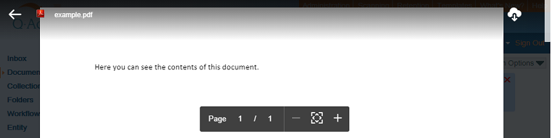
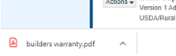
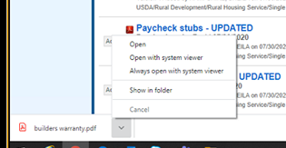

# Viewing Documents
---
In the left navigation pane, click **Documents**, and perform a search to locate a document.

If the document is not a PDF, you must download it to your computer in order to view it.  You can do this the following ways:

*   In List View, click the document title.
*   In the Grid View, double-click the document title.
*   In the Actions menu, click **Download Document**.

## Viewing PDF in Browser  
For PDFs, clicking or double-clicking on the document title will display a preview of the document in your browser as shown below.

You can also open this preview by clicking **Preview Document** in the **Actions** menu for PDFs.

To download a PDF, you can click **Download Document** in the **Actions** menu just like non-PDFs, or, when previewing a PDF, you can click on the download icon ().

You can tell the application to download PDFs when clicking or double-clicking on their title instead of previewing by going to your [User Profile](Configuring_User_Preferences.htm) and unchecking **Preview PDFs by Default**.  

## Downloaded Document
When a document downloads, it will appear in the bottom of your browser window.

You can open a downloaded document by simply clicking on the document's title in the bottom of the browser window.

# Configure Browser to Open Documents Automatically
---
## Downloaded Document Options  
After downloading a document, you can configure your browser to automatically open documents of that type in the future by clicking the **v or carrot(^)** symbol beside the document's name.

  
The menu that appears may vary based on the file type.

*   Select either Always open with system viewer or Always open files of this type (whichever option appears in the menu) to configure your browser to automatically open files of this type in the future.

{: .note}
You will need to repeat this process with each type of file you use (e.g. pdf, msg, pdf, docx, xlsx, jpeg) that you want your computer to automatically open.